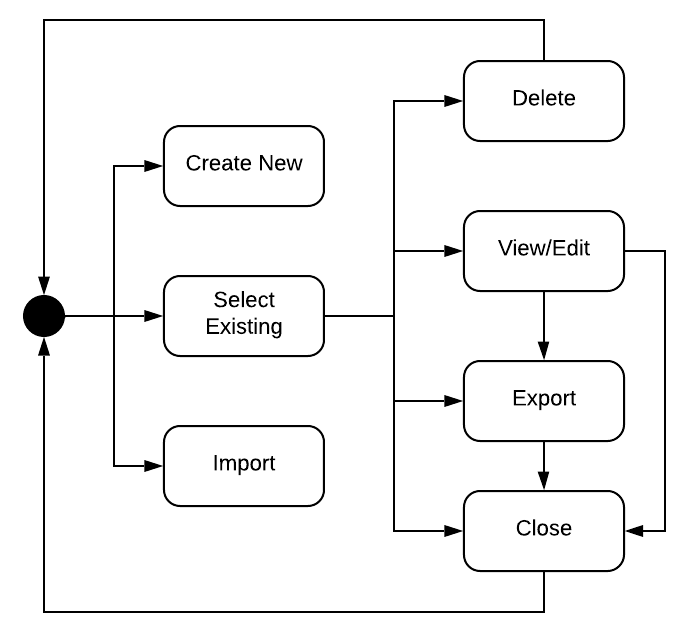
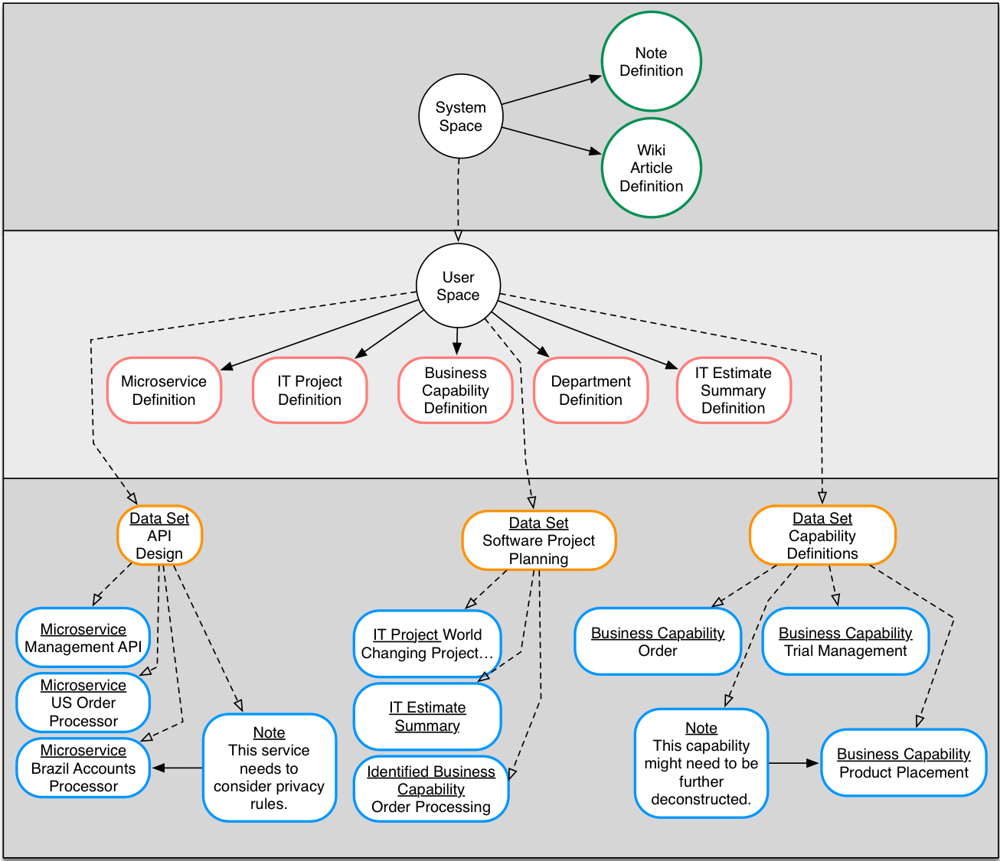

# Data Spaces
The data model is partition into multiple spaces based on intended use. They are: System Space, User Space, Data Sets

## System Space
The __system space__ is designated for [Element Definitions](./elements_overview.md#element-definition) that are provided
out of the box by the application. They can be used by the user but not redefined.

## User Space
The __user space__ is composed of all [Data Sets](./elements_overview.md#data-sets) and [Element Definitions](./overview.md#element-definition) defined by a user.

## Data Sets
A data set is a collection of [Element Definitions](./elements_overview.md#element-definition) and [Elements](./elements_overview.md#the-humble-element) specified by a user. They are analogous to a workspace. 
Elements created in a data set are not available in another. They provide top level partitioning of elements for the user.

### The Data Set Life Cycle
While the System Space and User Space cannot be directly manipulated by the user,
data sets can. They have a full life cycle in which users can create and manage
multiple data sets. The image below provides insight into the possible data set
life cycle.

New data sets are provisioned by either creating a new empty one or importing an
existing one. A user could import a data set they received from another person
or as a restore from an earlier export. Once a data set exists, a user can select it.
After it is selected the user can choose to edit it, view it, export a copy of it or 
even delete it. 

## Data Spaces Example
It is easier to understand the design intention of the data spaces with an example. 
Lynn is a user that designs IT systems. Imagine that Lynn is using Insights to 
help think through the work that will be required to build an IT system.

She starts by identifying the different data types she needs for defining her system.
She creates __Element Definitions__ for each of the data types. These definitions 
are stored in her user space. They can be used to create new __Elements__ in all 
the data sets she creates.

Lynn knows her system is going to need multiple APIs. To help think through this 
she creates a new data set called _API Design_. She also thinks that she's going
to do some high level project planning and requirements capture so she creates 
two more data sets: _Software Project Planning_ and _Capability Definitions_.

Now as Lynn starts to work on her design she hops from data set to data set 
creating and editing elements related to the overall data set topic. Each 
Element is an instance of an element definition she created earlier.

If she decides to add a __note__ about one of her elements she can leverage 
the out of the box Note Element Definition that is defined in the system space.

How the system treats Lynn's data is shown below.

