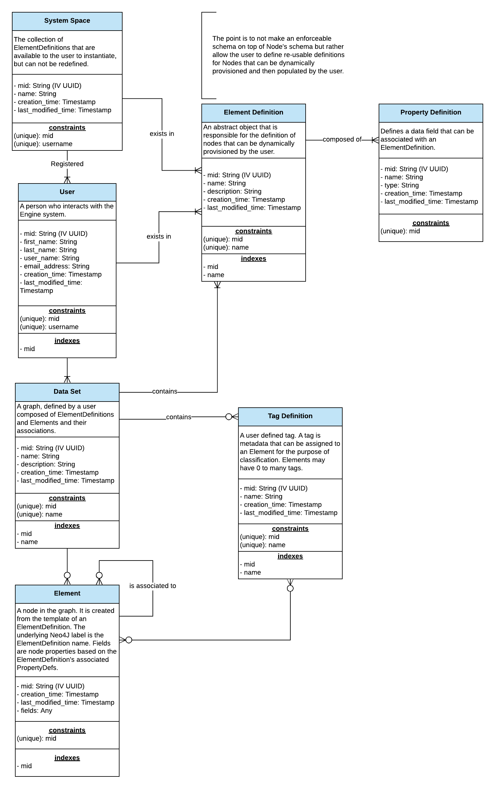

# The Data Model
The application data model can be seen in the below ERD diagram. 
A full Explanation of all entities is provided in the Node Definitions
section. 

## Node Definitions

### SystemSpace
The collection of ElementDefinitions that are available to the user 
to instantiate, but can not be redefined. There is currently only 
one instance of a SystemSpace node in a local graph.

| Field Name         | Description                      | Type      | Example                               | Constraints | Indexed | Deprecated |
|--------------------|----------------------------------|-----------|---------------------------------------|-------------|---------|------------| 
| mid                | The unique ID of the graph node. | IV UUID   | 329c4c3f-4213-4c82-90fb-05bac8943596  | Unique      | Yes     |            | 
| name               | A label for the system space.    | String    | System Space                          | Unique      |         |            | 
| creation_time      | When the node is created.        | Timestamp | 1535023012361                         |             |         |            | 
| last_modified_time | When the node was last modified. | Timestamp | 1535023012361                         |             |         |            | 

### User
A person who interacts with the application.

| Field Name         | Description                                              | Type      | Example                              | Constraints | Indexed | Deprecated |
|--------------------|----------------------------------------------------------|-----------|--------------------------------------|-------------|---------|------------|
| mid                | The unique ID of the graph node.                         | IV UUID   | 329c4c3f-4213-4c82-90fb-05bac8943596 | Unique      | Yes     |            |
| first_name         | The user's given name.                                   | String    | John                                 |             |         |            |
| last_name          | The user's family name.                                  | String    | Smith                                |             |         |            |
| user_name          | The user's prompted identifier. Used for authentication. | String    | jsmith                               | Unique      |         |            |
| email_address      | The user's recovery email address.                       | String    | jsmith@smith.com                     |             |         |            |
| creation_time      | When the node is created.                                | Timestamp | 1535023012361                        |             |         |            | 
| last_modified_time | When the node was last modified.                         | Timestamp | 1535023012361                        |             |         |            |  

### ElementDefinition
An abstract object that is responsible for the definition of nodes that can be 
dynamically provisioned by the user.

| Field Name         | Description                                         | Type      | Example                              | Constraints | Indexed | Deprecated |
|--------------------|-----------------------------------------------------|-----------|--------------------------------------|-------------|---------|------------|
| mid                | The unique ID of the graph node.                    | IV UUID   | 329c4c3f-4213-4c82-90fb-05bac8943596 | Unique      | Yes     |            |
| name               | The name of the Element Definition.                 | String    | Note                                 | Unique      | Yes     |            |
| description        | Explanation of what the Element Definition is for. | String    | Captures user thoughts.              |             |         |            |
| creation_time      | When the node is created.                           | Timestamp | 1535023012361                        |             |         |            | 
| last_modified_time | When the node was last modified.                    | Timestamp | 1535023012361                        |             |         |            |  
 
### PropertyDefinition
Defines a data field that can be associated with an ElementDefinition.
Note: Need to flush out the valid types. (Engine Issue #48)

| Field Name         | Description                         | Type      | Example | Constraints | Indexed | Deprecated |
|--------------------|-------------------------------------|-----------|--------------------------------------|-------------|---------|------------|
| mid                | The unique ID of the graph node.    | IV UUID   | 329c4c3f-4213-4c82-90fb-05bac8943596 | Unique      | Yes     |            |
| name               | The name of the field shall have.   | String    | Note                                 |             |         |            |
| type               | The data type the field shall have. | String    | Any                                  |             |         |            |
| creation_time      | When the node is created.           | Timestamp | 1535023012361                        |             |         |            | 
| last_modified_time | When the node was last modified.    | Timestamp | 1535023012361                        |             |         |            |  

### DataSet
A graph, defined by a user composed of ElementDefinitions and Elements and 
their associations.

| Field Name         | Description                               | Type      | Example                              | Constraints | Indexed | Deprecated |
|--------------------|-------------------------------------------|-----------|--------------------------------------|-------------|---------|------------|
| mid                | The unique ID of the graph node.          | IV UUID   | 329c4c3f-4213-4c82-90fb-05bac8943596 | Unique      | Yes     |            |
| name               | The name of the Data Set.                 | String    | Product Enhancements                 | Unique      | Yes     |            |
| description        | Explanation of what the Data Set is for. | String    | My Product Thoughts                  |             |         |            |
| creation_time      | When the node is created.                 | Timestamp | 1535023012361                        |             |         |            | 
| last_modified_time | When the node was last modified.          | Timestamp | 1535023012361                        |             |         |            | 

### Element
A node in the graph. It is created from the template of an ElementDefinition. 
The Element is created with two associated Labels:
* The ElementDefinition name. 
* The reserved word: element.

Fields are node properties based on the ElementDefinition's associated PropertyDefinition. 
Each associated PropertyDefinition results in a unique field added to the Element. 
The field's name and type match what is specified on the PropertyDefinition.

| Field Name         | Description                       | Type      | Example                              | Constraints | Indexed | Deprecated |
|--------------------|-----------------------------------|-----------|--------------------------------------|-------------|---------|------------|
| mid                | The unique ID of the graph node.  | IV UUID   | 329c4c3f-4213-4c82-90fb-05bac8943596 | Unique      | Yes     |            |
| fields             | See above note.                   | Any       | n/a                                  |             |         |            |
| creation_time      | When the node is created.         | Timestamp | 1535023012361                        |             |         |            | 
| last_modified_time | When the node was last modified.  | Timestamp | 1535023012361                        |             |         |            |  

### Tag Definition
A user defined tag. A tag is metadata that can be assigned to an Element for 
the purpose of classification. Elements may have 0 to many tags.

| Field Name         | Description                       | Type      | Example                              | Constraints | Indexed | Deprecated |
|--------------------|-----------------------------------|-----------|--------------------------------------|-------------|---------|------------|
| mid                | The unique ID of the graph node.  | IV UUID   | 329c4c3f-4213-4c82-90fb-05bac8943596 | Unique      | Yes     |            |
| name               | The name of the tag.              | String    | person, place, thing                 | Unique      | Yes     |            |
| creation_time      | When the node is created.         | Timestamp | 1535023012361                        |             |         |            | 
| last_modified_time | When the node was last modified.  | Timestamp | 1535023012361                        |             |         |            |  

## Database Constraints & Index Creation
All database constraints and indexes are created upon initializing a new database.
This is performed by org.machine.engine.graph.internal.SchemaCreator. See the 
code documentation for more details.

