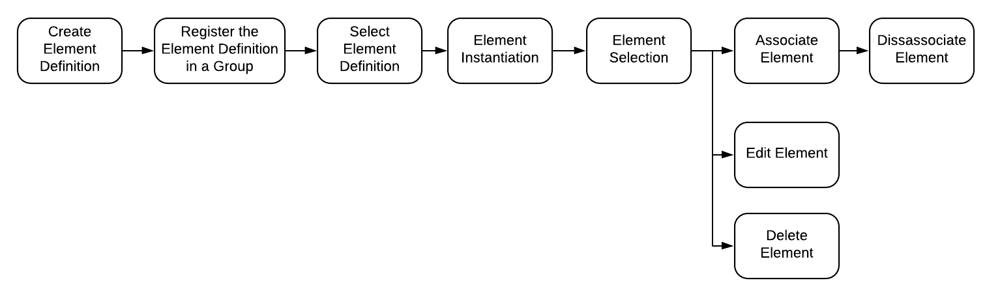

# The Humble Element
The application data model is simplistic by design. Rather than having hundreds of
predefined tables to capture the user's data a meta model is employed to empower
users to define how they want their data stored. This is accomplished through
the use of 3 node types: Element Definitions, Property Definitions and Elements.

## The Element Definition Node
An Element Definition is the heart of the Insights data model. It is what makes 
the dynamic data model possible. Users create new element definitions to define
what their data looks like. When they later capture data they do so by provisioning 
instances of their element definitions in the form of __elements__.

For software developers, the analogy of classes and objects is appropriate. In 
object orientated software classes are defined and then instances of the classes 
are created called objects. The same is true with Element Definitions. 

Element Definitions are simple. They are composed of a name, a description and a 
collection of __property definitions__. 

## The Property Definition Node
Property Definitions define what data fields are available on an element. Each 
Property Definition has a name and type.

### Property Definition Types
The _type_ value specified for a property definition has two effects. First, it specifies what the storage format is for the field on any instantiated elements and second, it drives what input control is displayed in the user interface on the Element form. There are two categories of property definition types: primitives and ADTs.

#### Primitive Types
Primitive types are the data types supported by Neo4J.  

* Integer
* Float
* String
* Boolean
* Spatial Point
* Date
* Time
* LocalTime
* DateTime
* LocalDateTime
* Duration

#### Abstract Data Types (ADT)
Abstract data types are combinations of primitives to enable common complex fields.

* Address
* Phone Number
* Email Address
* Markdown

## The Element Node
Elements are where the action is. They contain the actual user data. They are 
the vertices in the graph connected by edges. Even though the graph leverages 
a meta model, Elements are strongly typed. When a user provisions a new Element 
of a specific Element Definition type the application provisions a Neo4J node 
with a label that matches the Element Definition name. The fields on the new 
node are created according to the associated property definitions. 

Currently the Element Definition enforcement is only done at Element provisioning 
time. If a user changes an Element Definition after some Elements where provisioned, 
nothing happens to the existing Elements.
## Element Organization

### Element Tagging
A goal of the system is to allow the users to work with their data the way they
want to. As part of that, users should be allowed to categorize and group Elements
as they see fit. This is accomplished through the use of tags. 

#### Tag Rules
Tags are defined by the user in the context of a data set. They must be unique
in the scope of their containing data set. Tags may only contain alphanumeric 
characters (including spaces). Prefixed and trailing white space are removed.
Spaces between words are replaced with underscores.

#### Tag Implementation
When a tag is defined a __Tag Definition__ node is created and associated with 
the active Data Set node. When a tag is applied to an Element, it is added as 
a Neo4J [label](https://neo4j.com/docs/developer-manual/current/introduction/graphdb-concepts/).
Multiple tags may be applied to an element. Tags may also be removed. If a 
Tag Definition is deleted, the associated tag is also removed from all Elements.
The Elements, however, are not deleted. 

### The Element Life Cycle

