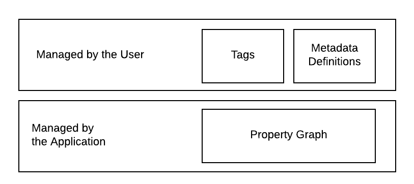

# The Data Model Overview
## Introduction
Insights leverages a graph database for storing user data. To accomplish this,
a metadata model is leveraged that enables the user to define how data is stored. This 
section attempts to provide insight into the metadata model.

## Neo4J Dependency
Currently, the embedded database is [Neo4J](https://neo4j.com/). This database 
is a graph database rather than a relational database. A graph database was 
selected primarily for two reasons.  

1. The application is designed to enable data collection about the relationship 
	between entities.  
2. The definition of data entities (i.e. tables) is delayed until runtime since 
	the user is the one specifying the data definitions. While this could be accomplished 
	by layering a meta-model on top of a relational or NoSQL database, a property 
	graph seemed to be a more natural fit.

## Data Layers
The data model is conceptually partitioned into two layers based on responsibility. 
The application manages the lower layer through direct manipulation of a property graph.  
The user manages the upper layer which is composed of tagging and meta data definitions.

### Property Graph
The primary responsibility of the application is to enable users to store their data in a safe, secure 
and reliable way. This is done via the Neo4J __property graph__. The graph is composed 
of vertices and edges. A vertex contains data. In the context of the application, 
a graph vertex is referred to as a __node__. Edges related the vertices to 
one another. Nodes and edges are the lowest level building blocks of the data model. They 
are not used directly by the user, rather higher order domain objects [are used](./elements_overview.md). 

### Meta Model
A key feature of the system is that it is not opinionated in what data may be stored.
This is enabled through the utilization of a [meta model](https://en.wikipedia.org/wiki/Metamodeling).
The __meta model__ allows users to define what graph elements they want to work with.
The point is to not make an enforceable schema on top of Neo4J's schema but rather to
allow the user to define re-usable definitions for Nodes that can be dynamically 
provisioned and then populated by the user.

### Tags
Working with graphs directly can be laborious. To assist with this, the data model provides 
the ability to define __tags__ to graph vertices. Tags can be used to search for items 
or drive the user interface.

