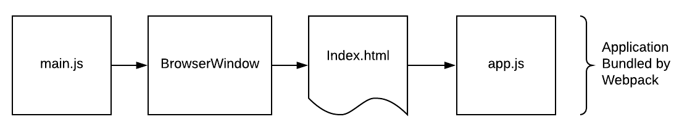
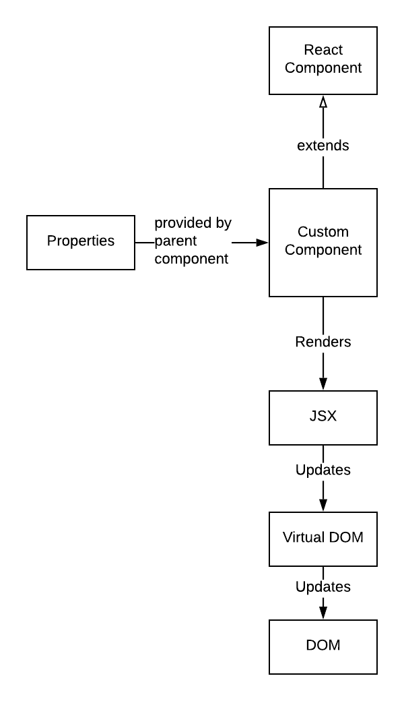
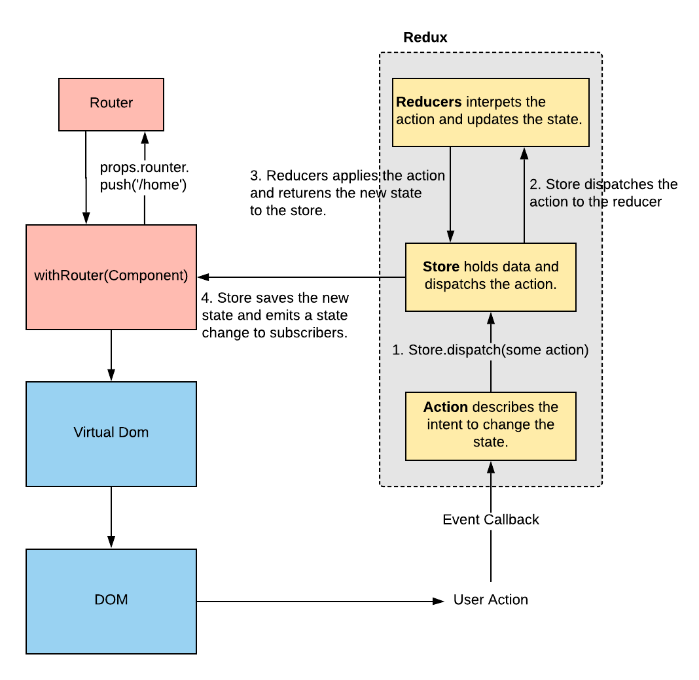

# Application Architecture
The Insights application architecture is a combination of Electron, React, Redux and CSS Modules.

## Application Bootstrap
The main application is built as a [Webpack](https://webpack.js.org/) bundle. This is then loaded via Electron in the below sequence.

## Core Technologies and Patterns

### React
[React](https://reactjs.org/) provides the view layer of the application architecture. The user interface is composed of components. A component is a Javascript class that extends [React.Component](https://reactjs.org/docs/react-component.html). A component is configured via properties that are passed in at runtime. When a component renders, a custom HTML like DSL called [JSX](https://reactjs.org/docs/introducing-jsx.html) is parsed to produce markup. This markup is used to update the React [Virtual DOM](https://reactjs.org/docs/faq-internals.html), which ultimately updates the [browser DOM](https://developer.mozilla.org/en-US/docs/Web/API/Document_Object_Model).

### Redux
Redux is a state container for React applications. It is leveraged to centralize state and provide  consistency across the application as to how 
user events are handled.
The Redux portion of the architecture is composed of:

* The Store: Centralizes the application state across all components.
* Reducer Functions: Responsible for processing state changes.
* Actions: Describes the intent to change state.

### CSS Modules
[CSS Modules](https://css-tricks.com/css-modules-part-1-need/) are a convention for bundling the required CSS with React components. This is enabled by Webpack with the [css-loader](https://www.npmjs.com/package/css-loader) and [style-loader](https://www.npmjs.com/package/style-loader) plugins.
