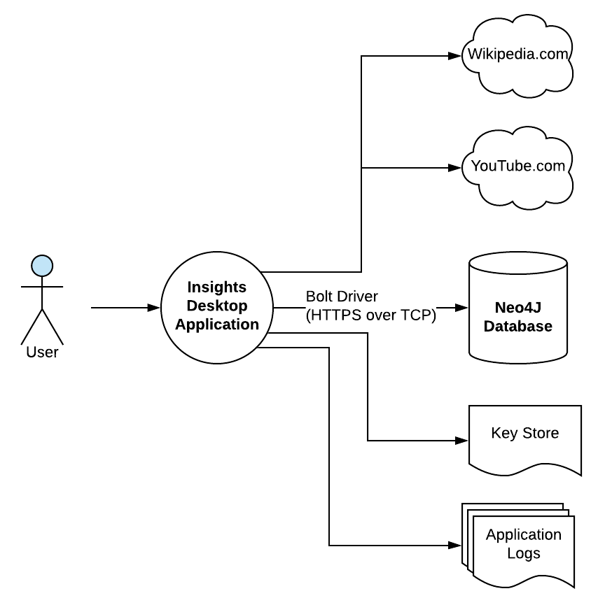

# The System Context
Insights is simple in concept. It is a desktop application that enables the user to capture data that is important to them in the way they want to capture it. As seen in the diagram below, there is a single persona of _user_ that directly interacts with _Insights_ via the user interface.
The application in turn communicates with the user specified _Neo4J graph database_ via the Javascript Bolt driver. Additionally, the application can fetch remote content such as web pages or streaming video from 3rd party systems such as Wikipedia.com or YouTube.com. 

