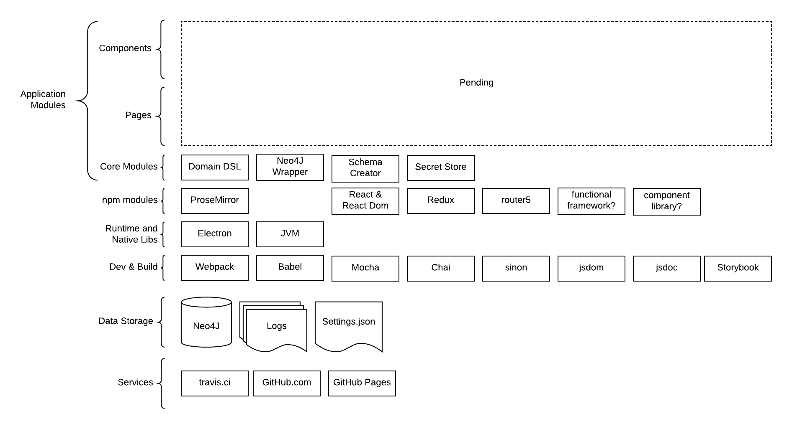

# Technology Stack
The application is composed of multiple technologies. The project is young and as such not all technologies have been selected. For the ones that are identified, they have been laid out in the layered diagram below.

## Technology Components
### User Interface Components
TBD

### User Interface Pages
TBD

### Core Modules
The core modules are application classes, functions and packages that provide supporting capabilities to the user interface or working with the database.

#### Engine DSL
A custom domain specific language (DSL) is created for working with the meta model on top of Neo4J.  

#### Neo4J Wrapper
A utility class for encapsulating Neo4J specific capabilities.

#### Schema Creator
A utility class for creating the meta model database schema.

#### Secret Store
A utility class for working with the operating system's keystore.

### NPM Modules
The NPM Modules are runtime dependencies leveraged by the _Core Modules_ or UI components.

#### ProseMirror
[ProseMirror](https://prosemirror.net/) is a 3rd party text editor framework. It is used by the Element editor.

#### React & React-DOM
[React](https://www.npmjs.com/package/react) and [React-DOM](https://www.npmjs.com/package/react-dom) are NPM modules of the popular React web component framework developed by Facebook.

#### Redux
[Redux](http://redux.js.org/) is a state container for Javascript applications. It is leveraged as an event based architecture for the user interface, as opposed to using other application architectures such as [Flux](https://facebook.github.io/flux/) or [MVC](https://en.wikipedia.org/wiki/Model%E2%80%93view%E2%80%93controller).

#### Router5
[Router5](https://router5.js.org/) is a Javascript routing engine. It is leverage for navigating between application pages.

#### Functional Framework
A design goal for the implementation of Insights is to prefer functional composition over object orientated solutions. To assist with this a functional framework or utility library will be used. Several are currently being evaluated for this purpose.

#### Component Library
A design goal for the implementation of Insights is to leverage off the shelf capabilities where possible. With this in mind a React component library will be selected that leverages a CSS framework. This is to avoid building common components (e.g. toolbars, tables, spinners) from scratch. 

### Runtime & Native Libraries
The application is not native. As such, it needs a supporting runtime to host the application.

#### Electron
[Electron](https://electronjs.org/) is a framework for building cross platform desktop applications with web technologies. Insights is built as an Electron app.

#### JVM
Insights does not depend on the Java Virtual Machine (JVM). However, Neo4J does. If the user is connecting Insights to a local instance of Neo4J, then the JVM is required. See the [Neo4J dependencies](https://neo4j.com/docs/operations-manual/current/installation/requirements/) for more details.

### Development Frameworks & Utilities 
The following frameworks and tools are leveraged for developing on Insights.

#### Webpack
[Webpack](https://github.com/webpack/webpack) is a bundler for Javascript applications. It is used to take all the application resources and package them together as an app.

#### Babel
[Babel](https://babeljs.io/docs/en/next/) is a Javascript transpiler. It is used for converting ES6 and React components into ES5.

#### Mocha
[Mocha](https://mochajs.org/) is a unit testing framework.

#### Chai
[Chai](http://chaijs.com/) is an assertion framework that is used with mocha for creating more readable tests.

#### Sinon
[Sinon](https://sinonjs.org/) is a spy and mocking framework that is used in writing unit tests.

#### JSDom
[JSDom](https://github.com/jsdom/jsdom#readme) is a headless browser DOM that is used for testing React components.

#### JSDoc
[JSDoc](https://devdocs.io/jsdoc/) is a source code markup library used for documenting Javascript.

#### Storybook.js
[Storybook.js](https://storybook.js.org/) is an application and framework that is used for the development, documentation and testing of user interface components.

### Data Storage
The application is a personal knowledge database. To accomplish this, the following data storage solutions are used.

#### Neo4J
[Neo4J](https://neo4j.com/) is a graph database. This project does not ship directly with Neo4J. Rather the application connects to an existing Neo4J database provided by the user.

#### Application Logs
Insights records internal system actions to application logs. 
TBD

#### Application Configuration
TBD

### Supporting Services
The following 3rd party services are leveraged for the application.

#### Travis.ci
Travis.ci provides continuous integration.

#### GitHub.com 
GitHub.com hosts the [code](https://github.com/sholloway/graph-insights) and related assets.

#### GitHub Pages
GitHub Pages are leveraged for hosting this design document.
